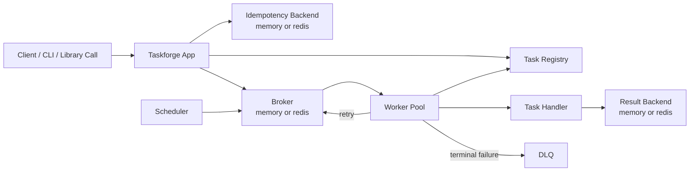

# Taskforge Workflow

This diagram shows the current high-level task execution flow.

```mermaid
flowchart LR
    A[Client / CLI / Library Call]
    B[Taskforge App]
    J[Idempotency Backend<br/>memory or redis]
    C[Task Registry]
    D[Broker<br/>memory or redis]
    E[Worker Pool]
    F[Task Handler]
    G[Result Backend<br/>memory or redis]
    H[DLQ]
    I[Scheduler]

    A --> B
    B --> C
    B --> J
    B --> D
    I --> D
    D --> E
    E --> C
    E --> F
    F --> G
    E -->|retry| D
    E -->|terminal failure| H
```
