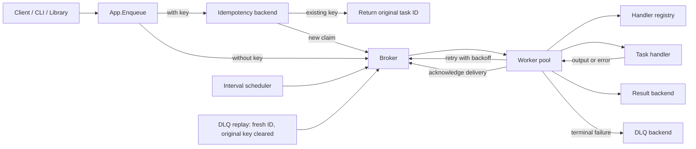

# Taskforge Workflow / Taskforge 执行流程

This diagram shows the current execution paths. Idempotency lookup is optional:
only keyed `App.Enqueue` calls claim or reuse an identity. Scheduler submissions,
worker retries and DLQ replay publish directly to the broker. The worker writes
results; handlers return output or an error to the worker.

下图展示当前执行路径。仅带键的 App.Enqueue 调用进行幂等认领或复用；周期任务、
自动重试和死信重放直接进入队列。处理函数向 Worker 返回输出或错误，由 Worker
保存结果。

Broker, result, DLQ and idempotency backends support memory or Redis. Memory state
is local to an App; Redis shares state across applications with matching settings.
The interval scheduler remains local to its process.

队列、结果、死信和幂等后端均支持内存或 Redis。内存状态属于各 App；连接设置一致
的应用可通过 Redis 共享状态。固定间隔调度器仍在本地进程运行。

Claim-and-enqueue, retry-and-ack, and result/DLQ writes are separate operations.
This diagram does not imply atomic transactions or exactly-once execution. See
[the architecture](ARCHITECTURE.md) and [the hardening proposal](docs/IDEMPOTENCY.md)
for current limits and planned improvements.

键认领与入队、重试与确认、结果及死信写入均为独立操作。图中连线不表示原子事务或
恰好一次执行；当前限制与增强规划见上述文档。
